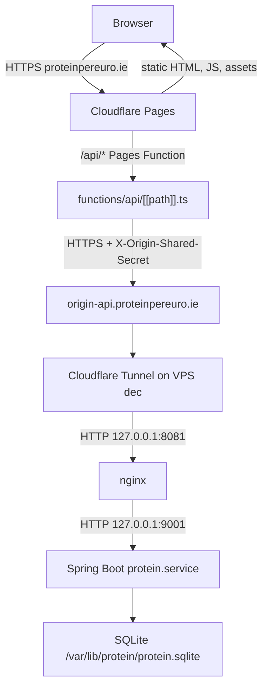
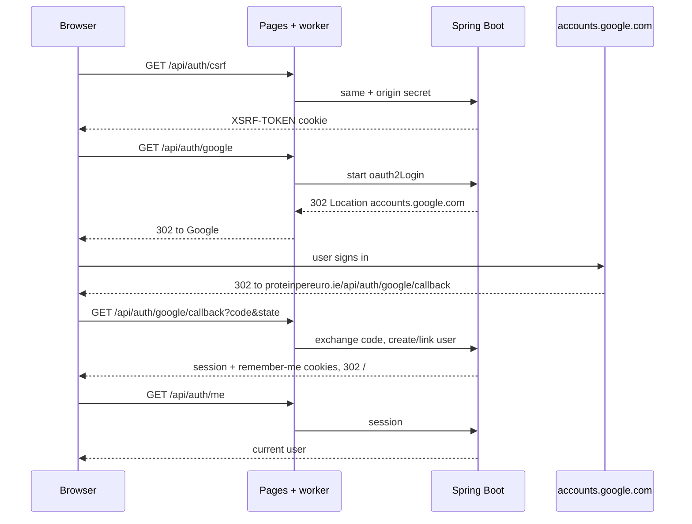
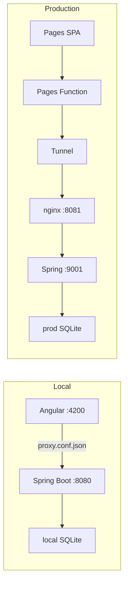

# Protein Per Euro architecture

Protein Per Euro compares supermarket foods by protein per euro. The browser
talks to one public hostname. The Angular app and the Spring Boot API live in
separate repos; production glues them together with a Cloudflare Pages worker,
a Cloudflare Tunnel, and nginx on the VPS.

This describes the current Google-login setup. Nginx itself is not in either
repo. Hosts and ports below come from the running production layout documented
in `TROUBLESHOOTING_LOG.md`.

## Repos

| Repo | Role |
| --- | --- |
| `protein` (this repo) | Spring Boot 3 API, SQLite, Google OAuth, price fetchers, OCR |
| `protein-frontend` | Angular 21 SPA, Cloudflare Pages project `protein`, Pages Function that proxies `/api` |

The browser never calls the VPS or `origin-api` directly. It only talks to
`https://proteinpereuro.ie`.

## Production request path



What each hop does:

1. **Cloudflare Pages** serves the Angular build (`dist/protein/browser`).
   `public/_redirects` sends unknown paths to `index.html` so Angular routing
   works. `public/_routes.json` sends `/api/*` to the Pages Function.
2. **Pages Function** (`protein-frontend/functions/api/[[path]].ts`) is a
   same-origin reverse proxy. It forwards the request to
   `https://origin-api.proteinpereuro.ie`, strips spoofable client/Cloudflare
   headers, injects `X-Origin-Shared-Secret` and `X-Client-IP`, and keeps
   cookies. It follows no redirects (`redirect: 'manual'`). It allows a
   `Location` to `https://accounts.google.com` so Google login can start. Other
   same-origin `Location` values are rewritten to public `proteinpereuro.ie`
   paths.
3. **Cloudflare Tunnel** (`cloudflared` on `dec`) is the only public path to
   the VPS. It terminates `origin-api.proteinpereuro.ie` and hands the request
   to nginx on loopback.
4. **nginx** listens on `127.0.0.1:8081` and proxies to Spring Boot. The nginx
   config is not in git.
5. **Spring Boot** listens on `127.0.0.1:9001` (`protein.service`). It is not
   internet-facing. Config lives in `/etc/protein/application.yml`. The jar is
   `/opt/protein/demo-0.0.1-SNAPSHOT.jar`.
6. **SQLite** is `/var/lib/protein/protein.sqlite`.

Health checks can skip the public hostname and hit Spring on the VPS:

```bash
ssh dec "curl -i -H 'X-Origin-Shared-Secret: <SECRET>' http://127.0.0.1:9001/api/auth/csrf"
```

`/api/health` and `/api/health/readiness` are the only API paths that skip
origin-secret enforcement.

## Why it is shaped this way

- The SPA and API share `proteinpereuro.ie`, so cookies and CSRF stay
  same-origin. Production CORS is empty on purpose.
- The VPS is not opened on the public internet. The tunnel is the ingress.
- The worker is the only client Spring trusts for `/api`. A shared secret
  proves the request came from that edge, not a random caller of
  `origin-api`.
- Google login is a browser redirect. The callback must come back through the
  public site so session and remember-me cookies are set on
  `proteinpereuro.ie`, not on localhost or `origin-api`.

## Auth

Login is Google OAuth2 only. There is no password, email verification, or
Turnstile path anymore.



Details:

- Angular `AuthService.loginWithGoogle()` does
  `window.location.assign('/api/auth/google')`.
- Spring `oauth2Login` is mounted at `/api/auth/{registrationId}` with
  callback `/api/auth/google/callback`.
- `GoogleLoginSuccessHandler` finds or creates the user by Google `sub`, or
  links an existing row with the same email. Unverified Google emails are
  rejected. It then sets session attributes and a remember-me cookie.
- Later requests use the session or remember-me cookie.
  `SessionUserFilter` restores the Spring `Authentication`.
- `GET /api/auth/me` is how the SPA knows who is signed in.
- `POST /api/auth/logout` clears remember-me tokens and the session.
- Admin is a database flag (`user_entity.is_admin`). Google login does not
  grant it. Flip the row, then sign in again.

Prod redirect URI, overridable with `GOOGLE_REDIRECT_URI`:

```text
https://proteinpereuro.ie/api/auth/google/callback
```

That exact URL must also be authorized on the Google Cloud OAuth client.

Local dev uses `http://localhost:4200/api/auth/google/callback` from
`application-dev.properties`.

## Security layers

| Layer | What it does |
| --- | --- |
| Origin shared secret | Worker sends `X-Origin-Shared-Secret`. Prod Spring enforces it on `/api/**` except health. |
| Trusted client IP | Worker sets `X-Client-IP` from `cf-connecting-ip`. Spring rate limits trust that header only after the secret is verified. |
| CSRF | `GET /api/auth/csrf` sets `XSRF-TOKEN`. Angular sends `X-XSRF-TOKEN` on unsafe requests. |
| Session + remember-me | HttpOnly, Secure, SameSite=Lax in prod. Remember-me is persisted in SQLite. |
| Rate limits | Logout, food create, comments, and OCR scans. |
| Retailer URL policy | Price fetchers only follow HTTPS allowlisted Irish retailer hosts. |

`ORIGIN_SHARED_SECRET` is an edge-to-origin secret. Do not put it in Angular.

## Backend

Package `com.example.demo`. Spring profile `prod` on the VPS, `dev` locally.

Public-ish HTTP surface:

| Path | Who |
| --- | --- |
| `GET /api/auth/csrf` | anyone |
| `GET /api/auth/google`, `GET /api/auth/google/callback` | login |
| `POST /api/auth/logout` | anyone (clears cookies) |
| `GET /api/auth/me` | signed-in user |
| `GET /api/food`, `GET /api/food/**`, `GET /api/comment/**` | public reads |
| Food create/update/delete, favorites, OCR | signed-in user |
| `POST /api/food/admin/**` | admin |
| `GET /api/health`, `GET /api/health/readiness` | probes; no origin secret |

Other work the API owns:

- Food CRUD, comments, favorites, duplicate detection
- Label OCR via Mistral
- Price refresh from Aldi, Lidl, Dunnes, Tesco (HTTP, with a Playwright
  fallback when a shop returns a Cloudflare challenge)
- Dev-only `/testing/**` scrapers, `dev` profile only

## Frontend

Angular 21 standalone app. It always calls `/api/...` on the current origin.

| Route | Notes |
| --- | --- |
| `/food` | public table; query params hold sort/filter/selection |
| `/graph` | lazy-loaded ECharts scatter plot |
| `/login` | Google button only |
| `/add-food`, `/edit/:id` | `authGuard` |
| `/help` | public |

On boot, `AuthService.bootstrapAuth()` loads CSRF, then `/api/auth/me`.
`authInterceptor` waits for that before other `/api` calls.

Local `ng serve` uses `proxy.conf.json` to send `/api` to
`http://localhost:8080`. The Pages worker is not in that path.

## Local vs production



| | Local | Production |
| --- | --- | --- |
| Frontend origin | `http://localhost:4200` | `https://proteinpereuro.ie` |
| API the browser sees | `/api` via Angular proxy | `/api` via Pages Function |
| Backend bind | `:8080` | `127.0.0.1:9001` |
| Google redirect | localhost:4200 callback | `https://proteinpereuro.ie/api/auth/google/callback` |
| Origin secret | off | required |
| Secure cookies | false | true |

## Production hosts and files

| Thing | Value |
| --- | --- |
| Public site | `https://proteinpereuro.ie` |
| Pages project | `protein` |
| Tunnel hostname | `origin-api.proteinpereuro.ie` |
| nginx | `127.0.0.1:8081` |
| Spring Boot | `127.0.0.1:9001` (`protein.service`) |
| Extra Spring config | `/etc/protein/application.yml` |
| Database | `/var/lib/protein/protein.sqlite` |

See `docs/production.md` for required env vars and `TROUBLESHOOTING_LOG.md`
for past outages.
